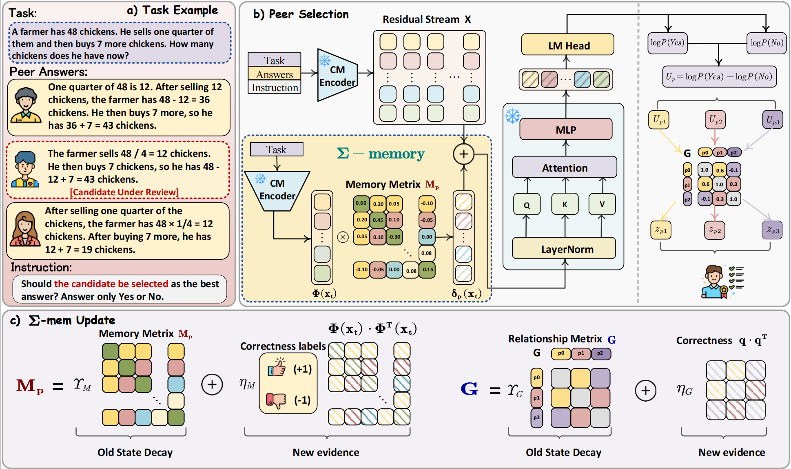

<div align="center">
<h2> Σ-Mem: An Online Reliability Memory for LLM-based Multi-Agent Systems
</h2>
</div>
<div align="center">

[Peilin Feng](https://peilin-ff.github.io/),
[Suorong Yang](https://suorongyang.github.io/)<sup>†</sup>,
[Soujanya Poria](https://soujanyaporia.github.io/)<sup>†</sup>

[DeCLaRe Lab](https://declare-lab.github.io/), Nanyang Technological University

<div align="center">
<!-- [](https://github.com/opendatalab/FakeVLM/issues)
[](https://github.com/opendatalab/FakeVLM/stargazers) -->

[](https://arxiv.org/pdf/2607.27958)
[](https://hits.seeyoufarm.com)
[](https://huggingface.co/Sssunset/Sigma-Mem)
[](https://huggingface.co/datasets/Sssunset/Sigma-Mem-Data)
</div>

</div>
This repository contains the official implementation, training and evaluation code,
and released data for **Σ-Mem: An Online Reliability Memory for LLM-based
Multi-Agent Systems**.


## 📰 News
- **[2026.08.01]**: 🤗 We are excited to release the Sigma-Mem dataset. Check it out on [Hugging Face](https://huggingface.co/datasets/Sssunset/Sigma-Mem-Data).
- **[2025.08.01]**: 🤗 We are excited to release the Sigma-Mem trained parameters. Check them out on [Hugging Face](https://huggingface.co/Sssunset/Sigma-Mem).
- **[2025.9.27]**: 🔥 We have released **Σ-Mem: An Online Reliability Memory for LLM-based Multi-Agent Systems**. Check out the [paper](https://arxiv.org/pdf/2607.27958).


## Σ-Mem Overview

<div align="center">

</div>

We introduce **$\Sigma$-Mem**, an online reliability memory for LLM-based multi-agent
systems. $\Sigma$-Mem records two complementary signals: peer-specific **historical
competence evidence**, which captures when each peer has been reliable, and
**peer-relationship evidence**, which captures how peers tend to succeed or fail
together. External correctness feedback updates the peer memory matrices
$\{\mathbf{M}_p\}$ and relationship matrix $\mathbf{G}$ online. Their readouts can
steer the frozen central model's response evaluation, route a task before peer answers
are observed, or weight peer outputs without retraining the underlying models.

We evaluate $\Sigma$-Mem with five Qwen-family central models under counterfactual
reliability shifts, unseen-peer settings, and OOD benchmarks beyond its training
domains. The results show that the recorded reliability state supports more accurate
and adaptive peer coordination across selection, routing, and weighted aggregation.

##  Contributions

- We propose **$\Sigma$-Mem**, an online reliability memory that records
  peer-specific historical competence and peer-to-peer relationship evidence from
  externally verified correctness feedback.
- We represent both reliability states as real symmetric matrices with decayed,
  bounded updates. This makes each update spectrally controlled while allowing
  persistent, task-aligned evidence to accumulate over time.
- Across five central models, $\Sigma$-Mem adapts to counterfactual reliability
  shifts and generalizes to unseen peers and domains. The same memory supports
  residual-steered peer selection, response-free routing, and reliability-weighted
  voting without additional training.

## Environment Setup
Qwen3 and Qwen3.5 require different
`transformers` versions, so use separate environments when evaluating both model
families.

```bash
# Qwen3
pip install -r requirements_qwen3.txt

# Qwen3.5
pip install -r requirements_qwen3.5.txt
```

## 📝 Model Preparation

Download the open-source center models:

```bash
cd sigma-mem
mkdir -p models

hf download Qwen/Qwen3-0.6B --local-dir models/Qwen3-0.6B
hf download Qwen/Qwen3-4B --local-dir models/Qwen3-4B
hf download Qwen/Qwen3-8B --local-dir models/Qwen3-8B
hf download Qwen/Qwen3.5-4B --local-dir models/Qwen3.5-4B
hf download Qwen/Qwen3.5-9B --local-dir models/Qwen3.5-9B
```

Download all five peer models. The standard three-peer experiments use peers 1--3;
the peer generalization experiments additionally use peers 4 and 5.

<!-- | Peer | Hugging Face repository | Local directory |
| --- | --- | --- |
| Peer 1 (`peer_0`) | `google/gemma-3-4b-it` | `models/gemma-3-4b-it` |
| Peer 2 (`peer_1`) | `microsoft/Phi-4-mini-instruct` | `models/Phi-4-mini-instruct` |
| Peer 3 (`peer_2`) | `Qwen/Qwen2.5-Coder-7B-Instruct` | `models/Qwen2.5-Coder-7B-Instruct` |
| Peer 4 (`peer_3`) | `meta-llama/Llama-3.2-3B-Instruct` | `models/Llama-3.2-3B-Instruct` |
| Peer 5 (`peer_4`) | `openbmb/BitCPM-CANN-3B` | `models/BitCPM-CANN-3B` | -->

```bash
hf download google/gemma-3-4b-it \
  --local-dir models/gemma-3-4b-it
hf download microsoft/Phi-4-mini-instruct \
  --local-dir models/Phi-4-mini-instruct
hf download Qwen/Qwen2.5-Coder-7B-Instruct \
  --local-dir models/Qwen2.5-Coder-7B-Instruct
hf download meta-llama/Llama-3.2-3B-Instruct \
  --local-dir models/Llama-3.2-3B-Instruct
hf download openbmb/BitCPM-CANN-3B \
  --local-dir models/BitCPM-CANN-3B
```
After downloading the open-source model weights, download
the trained Sigma-Mem parameters:

```bash
hf download Sssunset/Sigma-Mem --local-dir models/Sigma-Mem
```

The resulting directory layout is:

```text
models/
├── Qwen3-0.6B/
├── Qwen3-4B/
├── Qwen3-8B/
├── Qwen3.5-4B/
├── Qwen3.5-9B/
├── gemma-3-4b-it/
├── Phi-4-mini-instruct/
├── Qwen2.5-Coder-7B-Instruct/
├── Llama-3.2-3B-Instruct/
├── BitCPM-CANN-3B/
└── Sigma-Mem/
    ├── Qwen3-0.6B/
    ├── Qwen3-4B/
    ├── Qwen3-8B/
    ├── Qwen3.5-4B/
    └── Qwen3.5-9B/
```

The checked-in configs and experiment profiles load these paths directly. The
Sigma-Mem download contains only the learned memory/projection parameters and does
not duplicate or modify the center-model weights.

## 📦 Data Preparation

Download the training and evaluation dataset into `data/`:

```bash
hf download Sssunset/Sigma-Mem-Data \
  --repo-type dataset \
  --local-dir data
```

### Dataset Card

The dataset is organized into five data directories. For the
counterfactual groups, the event number below applies to each of the four CF streams.

| Directory | Events | Peers | Description |
| --- | ---: | ---: | --- |
| `mixed_train` | 2,963 | 3 | Offline training stream from GSM8K, SQuAD, and APPS |
| `counterfactual_3peer` | 2,685 | 3 | CF@0, CF@50, CF@70, and CF@90 evaluation streams |
| `counterfactual_4peer` | 2,685 | 4 | CF streams extended with Llama-3.2-3B-Instruct |
| `counterfactual_5peer` | 2,685 | 5 | CF streams further extended with BitCPM-CANN-3B |
| `ood` | 17,403 | 3 | OOD evaluation stream over six benchmarks |

After downloading, the files used by the default configs and evaluation commands are:

```text
data/
  mixed_train/train.jsonl
  counterfactual_3peer/cf_{0,50,70,90}.jsonl
  counterfactual_4peer/cf_{0,50,70,90}.jsonl
  counterfactual_5peer/cf_{0,50,70,90}.jsonl
  ood/test.jsonl
```

## 🚀 Evaluation

### Base, Sigma-Mem, and joint G

`tests.experiments.common.evaluate_sigma` is the shared evaluator. The three main
arms differ only in the indicated flags. The following example evaluates one CF
stream; replace `DATA` with the OOD stream to run the same methods OOD.

```bash
MODEL=models/Qwen3-0.6B
CKPT=models/Sigma-Mem/Qwen3-0.6B
DATA=data/counterfactual_3peer/cf_50.jsonl

COMMON_ARGS=(
  --config configs/symmetric_memory_candidate_yesno.yaml
  --central_model "$MODEL"
  --offline_data "$DATA"
  --max_length 8192
)

# Base: central model evaluation without memory steering.
python -m tests.experiments.common.evaluate_sigma \
  "${COMMON_ARGS[@]}" \
  --ablate_memory \
  --output outputs/example/base

# Sigma-Mem without G.
python -m tests.experiments.common.evaluate_sigma \
  "${COMMON_ARGS[@]}" \
  --checkpoint "$CKPT" \
  --graph_posterior off \
  --output outputs/example/sigma

# Sigma-Mem with joint G.
python -m tests.experiments.common.evaluate_sigma \
  "${COMMON_ARGS[@]}" \
  --checkpoint "$CKPT" \
  --graph_posterior ising \
  --output outputs/example/sigma_joint_g
```

Each output directory contains:

- `eval_metrics.json`: accuracy, run settings, feedback metadata, and peer-selection totals.
- `selections.jsonl`: selected peer, per-peer scores, correctness, and feedback status for every event.

To run Sigma-Mem without G over all four CF ratios:

```bash
TAG=q3_0.6b \
MODEL=models/Qwen3-0.6B \
GPU=0 \
bash tests/experiments/counterfactual/run_sigma.sh
```

Override `CKPT`, `TEST_DIR`, `EVAL_ROOT`, or `LOG_ROOT` when using different paths.
Use the shared evaluator above for the Base and joint-G arms.

### Direct M readout and Beta B1 on CF streams

M-Route derives reliability from the question and current `M` state without reading
the peer answers. The Beta B1 baseline is model-independent.

```bash
python -m tests.experiments.counterfactual.m_route \
  --profile q3_4b \
  --data-dir data/counterfactual_3peer

python -m tests.experiments.counterfactual.beta_b1 \
  --warm-data data/mixed_train/train.jsonl \
  --cf-dir data/counterfactual_3peer
```

M-Route writes `outputs/cf_memory_routing/<profile>/summary.json` by default. Beta
B1 writes `outputs/cf_beta_b1/summary.json`.

### OOD routing and voting

Run the shared evaluator above with the OOD JSONL to obtain Base and full Sigma-Mem
results. The following diagnostic computes Majority, M-Route, and M-Vote. It uses the
center model only to encode the current question into `phi`; no peer response enters
the routing readout.

```bash
python -m tests.experiments.selection_mechanisms.m_route_vote \
  --profile q3_4b \
  --offline-data data/ood/test.jsonl
```

Available profiles are `q3_0_6b`, `q3_4b`, `q3_8b`, `q35_4b`, and `q35_9b`.
Each run writes `summary.json`, `records.jsonl`, `phis.npy`, and
`phi_manifest.json` under the profile's configured `routing_output`.

### Feedback availability

The feedback ablation uses Qwen3.5-4B and Qwen3.5-9B at 5%, 10%, 20%, 50%, 80%,
and 100% feedback with three seeds. First create the OOD phi caches for both models:

```bash
python -m tests.experiments.selection_mechanisms.m_route_vote --profile q35_4b
python -m tests.experiments.selection_mechanisms.m_route_vote --profile q35_9b
```

Then run the direct-M replay, generate the Sigma score streams, and summarize the
joint-G replay:

```bash
python -m tests.experiments.feedback_availability.m_route_vote

python -m tests.experiments.feedback_availability.run_sigma \
  --python "$(command -v python)" \
  --gpus 0 1

python -m tests.experiments.feedback_availability.summarize_sigma
```

The direct-M summary is written to `outputs/ood_feedback_sparsity/summary.json`.
The combined Sigma-Mem summary is written to
`outputs/ood_sigma_feedback_sparsity/summary.json`.

### Generalization to more peers

The four-/five-peer scheduler evaluates Base and Sigma-Mem with the runtime state
resized to the requested peer count:

```bash
GPUS="0 1 2 3" \
PY_SIGMA="$(command -v python)" \
PY_SIGMA35=/path/to/qwen35/environment/bin/python \
bash tests/experiments/peer_generalization/run_sigma.sh
```

Use `PEER_COUNTS="4"` or `SPLITS="cf_0 cf_90"` to run a subset. The scheduler skips
completed outputs containing `eval_metrics.json`.
